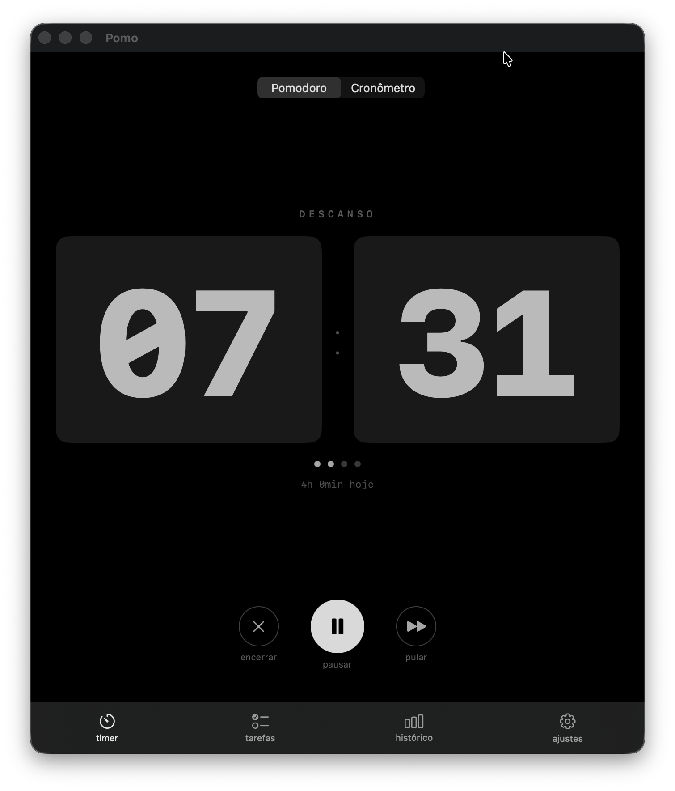
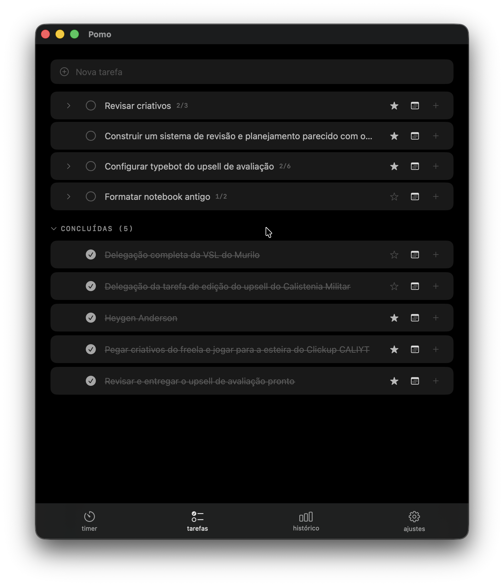
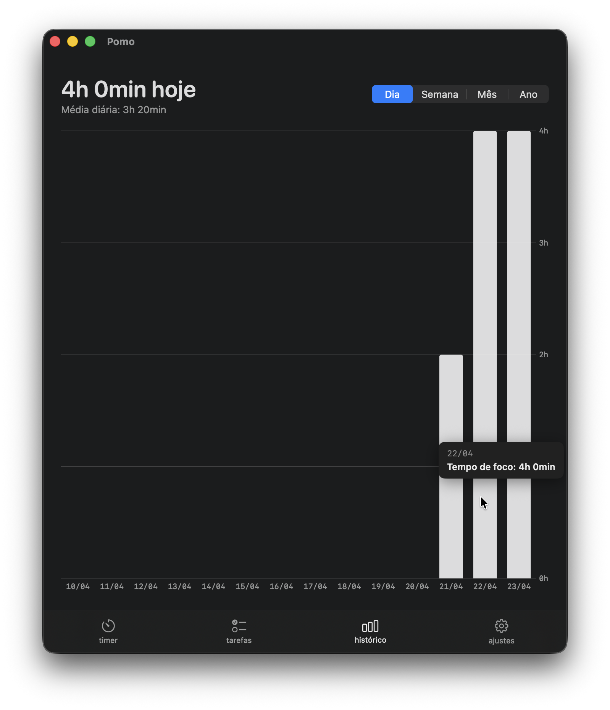
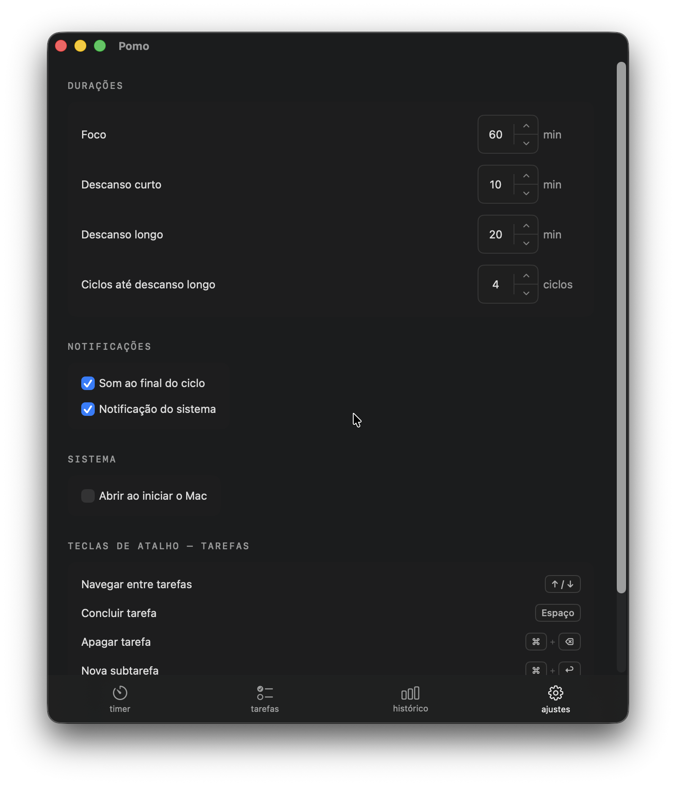

# Pomo

Aplicativo de timer Pomodoro para macOS com gerenciamento de tarefas e histórico de sessões.

**Requisito:** macOS 14 (Sonoma) ou superior.

---

## Capturas de tela

<table>
  <tr>
    <td align="center"><b>Timer</b></td>
    <td align="center"><b>Tarefas</b></td>
  </tr>
  <tr>
    <td></td>
    <td></td>
  </tr>
  <tr>
    <td align="center"><b>Histórico</b></td>
    <td align="center"><b>Ajustes</b></td>
  </tr>
  <tr>
    <td></td>
    <td></td>
  </tr>
</table>

---

## Instalação

### 1. Baixar o app

Acesse a página de releases e baixe o arquivo `Pomo.zip`:

**https://github.com/joaopedromei-prog/pomo-app/releases/latest**

### 2. Instalar

1. Descompacte o `Pomo.zip`
2. Mova `Pomo.app` para a pasta `/Applications`

### 3. Primeira abertura — aviso de segurança

> **Atenção:** O Pomo não é distribuído pela App Store nem possui assinatura da Apple, por isso o macOS exibe um aviso de segurança na primeira vez que você abrir.

**Como contornar:**

- Clique com o botão direito em `Pomo.app` → **Abrir** → na janela de aviso, clique em **Abrir mesmo assim**

Esse aviso só aparece uma vez. Nas próximas aberturas o app abre normalmente.

**Alternativa via Terminal:**

```bash
xattr -rd com.apple.quarantine "/Applications/Pomo.app" && open "/Applications/Pomo.app"
```

---

## Funcionalidades

### Timer

O Pomo tem dois modos de timer:

**Pomodoro** — ciclo de foco e descanso:
- Foco → Descanso curto → Foco → Descanso curto → ... → Descanso longo (a cada 4 ciclos)
- O timer avança automaticamente ao terminar cada fase
- Sons e notificações do sistema ao final de cada ciclo

**Cronômetro** — tempo livre, sem ciclos predefinidos

### Tarefas

- Crie tarefas no campo superior e pressione Enter
- Suporte a hierarquia ilimitada (tarefas e subtarefas)
- Organize com arrastar e soltar
- Estrela para priorizar — tarefas com estrela ficam sempre no topo
- Data de vencimento com badges visuais (destaque para atrasadas e de hoje)
- Tarefas concluídas ficam em uma seção separada ("CONCLUÍDAS") que pode ser expandida

### Histórico

Visualização das sessões de foco registradas em gráfico de barras com quatro granularidades:

- **Dia** — horas por hora do dia atual
- **Semana** — totais diários da semana
- **Mês** — totais diários do mês
- **Ano** — totais mensais do ano

### Menu bar

O Pomo fica na barra de menus do macOS. Clique no ícone para abrir rapidamente sem tirar o foco da janela atual.

---

## Atalhos de teclado

| Atalho | Ação |
|---|---|
| `Space` | Marcar/desmarcar tarefa selecionada |
| `Cmd + Delete` | Apagar tarefa selecionada |
| `Cmd + ]` | Indentar (tornar subtarefa da anterior) |
| `Cmd + [` | Remover indentação (subir um nível) |
| `Option + Enter` | Adicionar subtarefa à tarefa selecionada |
| `Enter` (editando) | Confirmar edição |
| `Esc` (editando) | Cancelar edição |
| Duplo clique | Editar título da tarefa |

---

## Configurações

Acesse a aba **Configurações** dentro do app para ajustar:

| Configuração | Padrão | Intervalo |
|---|---|---|
| Duração do foco | 60 min | 5–120 min |
| Descanso curto | 10 min | 1–30 min |
| Descanso longo | 20 min | 5–60 min |
| Ciclos até descanso longo | 4 | 2–8 |
| Som ao final do ciclo | Ativado | — |
| Notificação do sistema | Ativado | — |
| Abrir ao iniciar o Mac | Desativado | — |

---

## Dados salvos

O app salva todos os dados localmente em:

```
~/Library/Application Support/Pomo/
├── tasks.json      # Lista de tarefas
├── sessions.json   # Histórico de sessões
├── weekly.json     # Agregados semanais (sessões > 30 dias)
└── monthly.json    # Agregados mensais (sessões > 1 ano)
```

Nenhum dado é enviado para servidores externos.

---

## Compilar a partir do código-fonte

Requer Swift 5.9+ e o Xcode Command Line Tools instalados.

```bash
git clone https://github.com/joaopedromei-prog/pomo-app.git
cd pomo-app
bash scripts/install.sh
```

O script compila o app no modo release, gera o ícone e instala automaticamente em `/Applications/Pomo.app`.
